# Fastfetch Star Lore

Colorful, lore-inspired artwork for [Fastfetch](https://github.com/fastfetch-cli/fastfetch). Stargate, Star Trek, and Independence Day use native full-color pixel sprites in Kitty and fall back to portable ANSI art elsewhere.

## Stargate gallery

These are the actual full-color Kitty sprite assets included in the package.

<p align="center">
  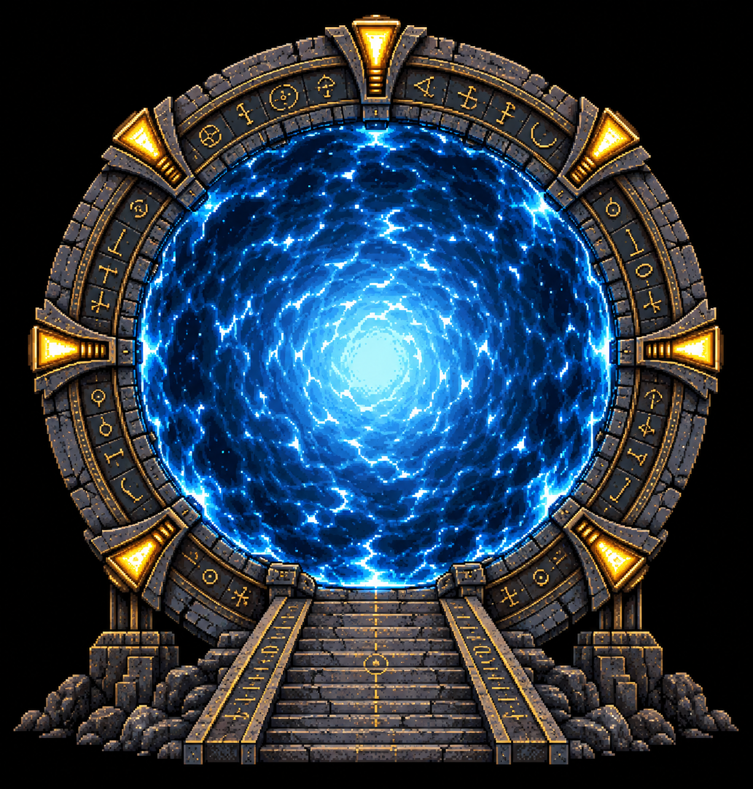
  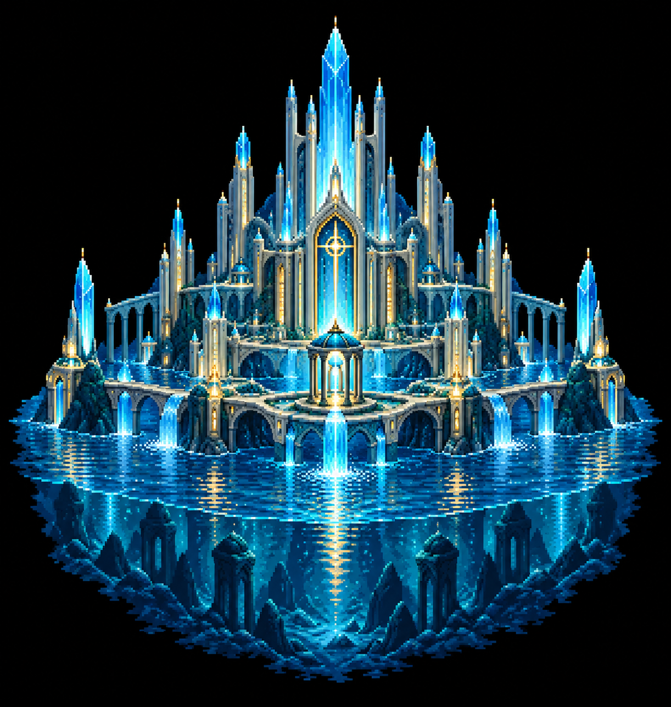
  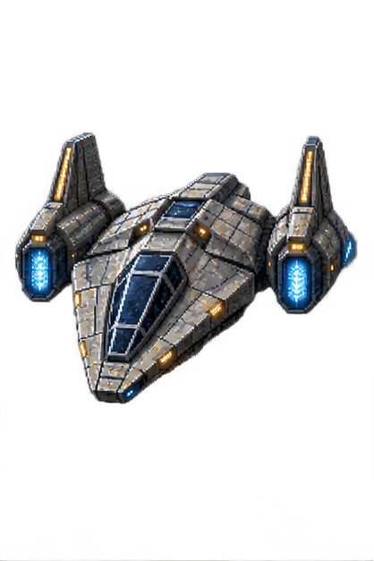
</p>

## Star Trek gallery

These are representative native Kitty sprite assets; the rotation includes more.

<p align="center">
  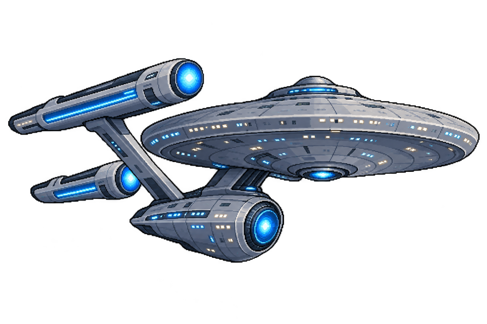
  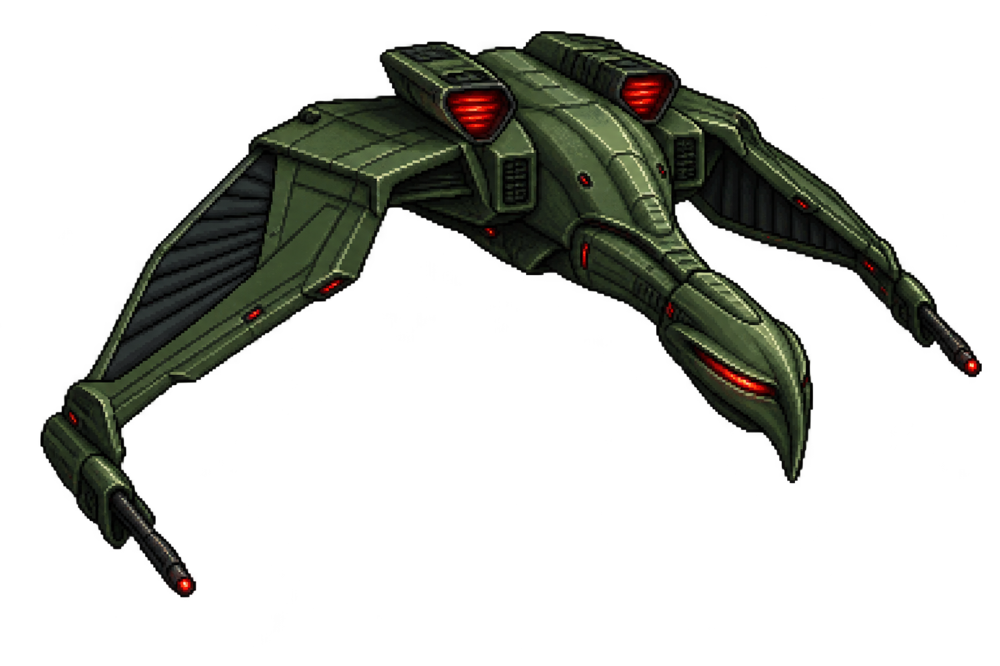
  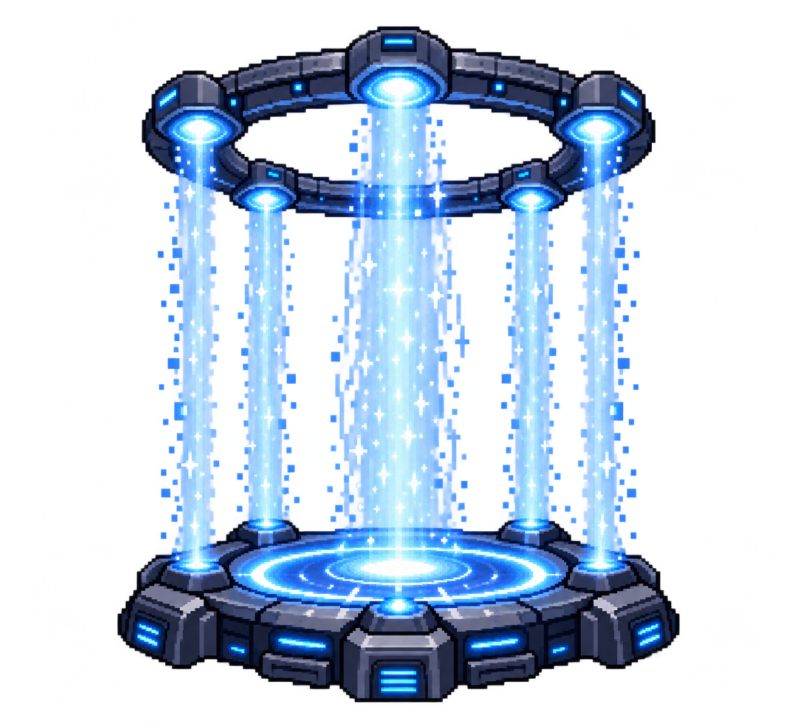
</p>

All full-color pixel sprites are original AI-generated artwork, created with OpenAI image generation and included as repository assets. They are lore-inspired designs, not converted show screenshots, promotional images, or copied artwork.

## Independence Day gallery

<p align="center">
  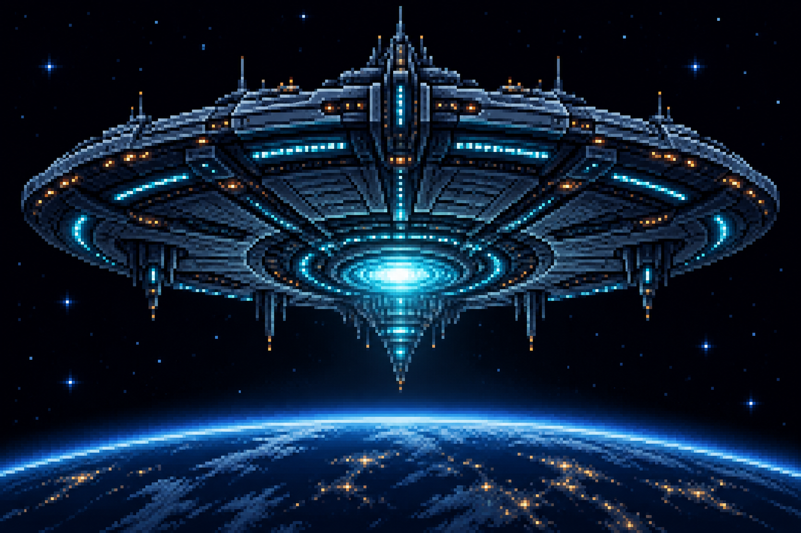
  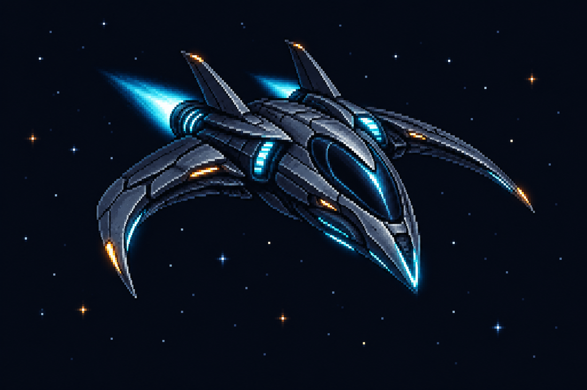
  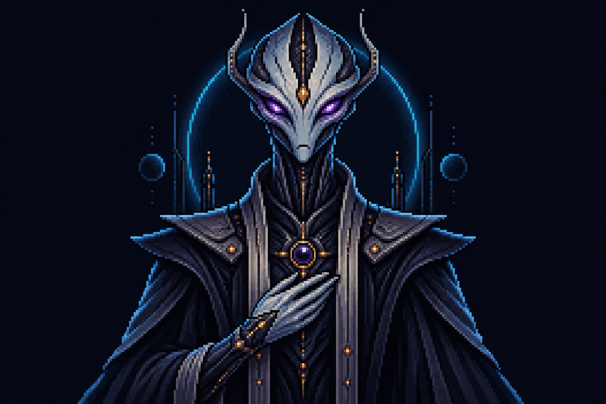
</p>
<p align="center">
  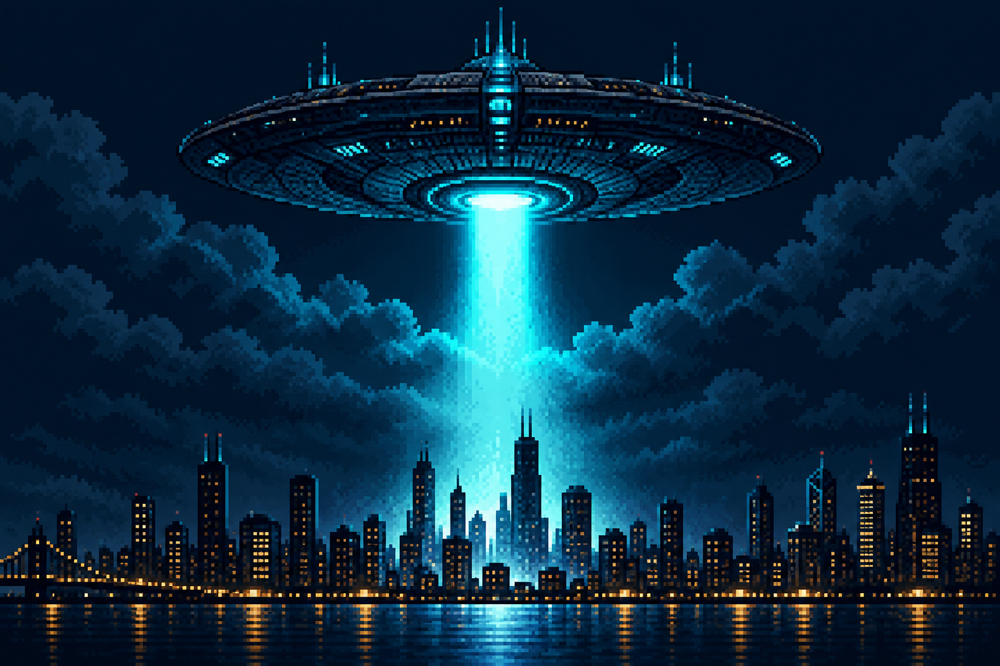
  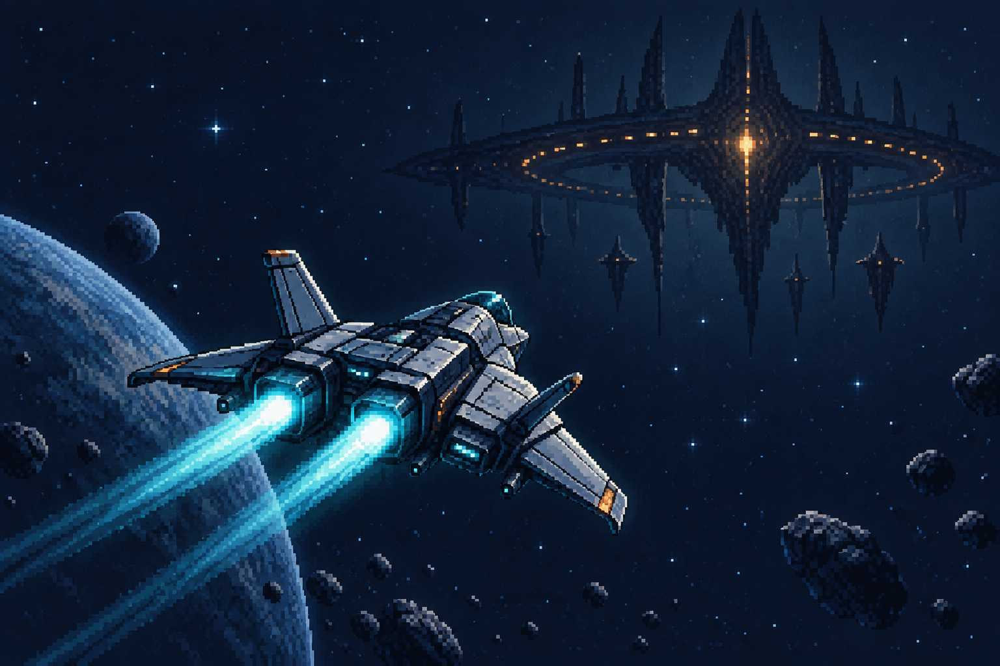
  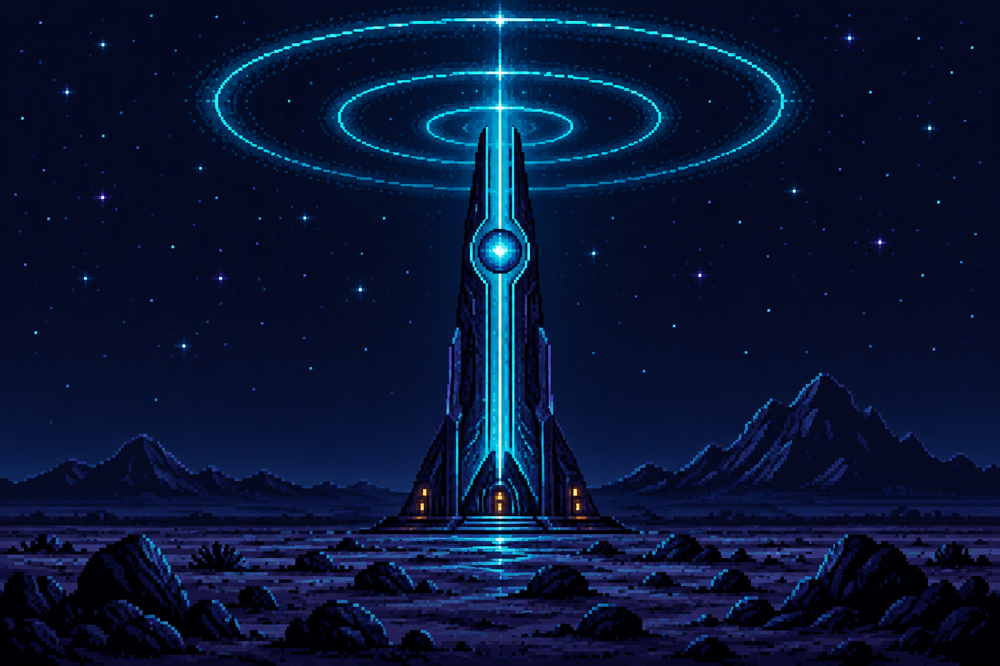
</p>

## Franchises

| Category | Status | Contents |
| --- | --- | --- |
| `stargate` | Available | Full-color Kitty sprites: active Stargate, DHD, ZPM, Goa'uld hand device, staff weapon, Ancient chair, MALP, Atlantis City, Atlantis Gate, Puddle Jumper, Universe Gate, Destiny, and Al'kesh |
| `star-trek` | Available | ANSI art: communicator, tricorder, phaser, warp core, Borg cube, PADD, and bat'leth. Kitty sprites: Federation-inspired starship, Klingon-inspired bird-of-prey, Vulcan science vessel, tricorder, transporter, and Vulcan salute |
| `independence-day` | Available | Full-color Kitty sprites: city-scale mothership, alien interceptor, extraterrestrial ambassador, city beam, resistance interceptor, and signal beacon. ANSI art includes brief movie-quote references |
| `star-wars` | Planned | Reserved for future artwork |

## Install

Fastfetch and Zsh are required. Clone the repository, then install it:

```sh
git clone git@github.com:warkanum/fastfetch-star-lore.git
cd fastfetch-star-lore
./install.sh --renderer sprite
```

This installs the command into `~/.local/bin` and its art into `~/.local/share/fastfetch-star-lore`. Ensure `~/.local/bin` is on your `PATH`.

Choose `sprite` (the default) for full-color native Kitty images, or `raw` for portable plain ANSI art. To also start it automatically in new Zsh terminals:

```sh
./install.sh --shell --renderer raw
```

The renderer choice is stored in `~/.config/fastfetch-star-lore/config`; rerun the installer with the other choice to switch later. The installer adds a clearly marked block to `~/.zshrc` and will not add it twice.

## Use

Run a category manually:

```sh
fastfetch-star-lore stargate
```

Independence Day lore is also available directly:

```sh
fastfetch-star-lore independence-day
```

Randomly choose from every available category:

```sh
fastfetch-star-lore random
```

`all` is an alias for `random`. This chooses a franchise first, then its normal artwork rotation chooses a sprite (or ANSI design).

By default Fastfetch uses its normal configuration. To use a specific Fastfetch configuration:

```sh
fastfetch-star-lore stargate --config ~/.config/fastfetch/config-pokemon.jsonc
```

In Kitty, Stargate uses native full-color pixel-art sprites and changes on each invocation. Pin one with `STARGATE_SPRITE_INDEX` from `1` through `13` (the active Stargate is `1`):

```sh
STARGATE_SPRITE_INDEX=2 fastfetch-star-lore stargate
```

In another terminal emulator, it falls back to ANSI art. Set `STAR_LORE_RENDERER=raw` to use that fallback in Kitty too.

In Kitty, Star Trek randomly selects a full-color sprite. Pin one with `STAR_TREK_SPRITE_INDEX` from `1` through `6` (the Federation-inspired starship is `1`):

```sh
STAR_TREK_SPRITE_INDEX=3 fastfetch-star-lore star-trek
```

Outside Kitty, Star Trek uses its ANSI-art rotation, which can be pinned with `STAR_TREK_ART_INDEX`.

Pin an Independence Day Kitty sprite with `INDEPENDENCE_DAY_SPRITE_INDEX` from `1` through `6`; its ANSI fallback can be pinned with `INDEPENDENCE_DAY_ART_INDEX` from `0` through `2`.

## Add a franchise

Put its renderer at `art/<category>/art.zsh`, add the category to `bin/fastfetch-star-lore`, and document it in the table above. ANSI renderers write to standard output; Kitty sprite categories can instead select an image asset for Fastfetch's native Kitty logo mode.

## License

[MIT](LICENSE)
